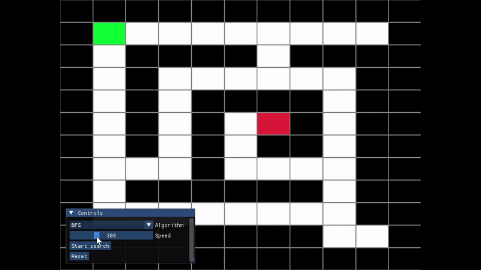
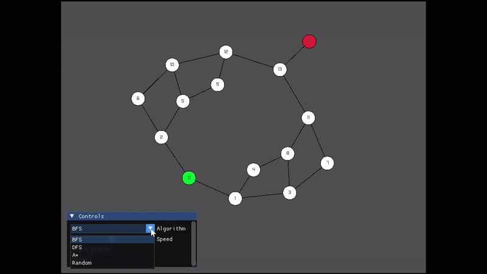

# Graph Traversal Visualizer

A modular C++ application for visualizing pathfinding and graph traversal algorithms.

## Demo

### Graph Traversal


### Maze Traversal


## Features
- Support for grid-based mazes and general adjacency list graphs.
- Interactive control panel for algorithm selection and speed control.
- Path reconstruction and edge animations.

## Tech Stack
- Graphics: Raylib
- UI: Dear ImGui (via rlImGui)
- Build System: CMake 3.11+

## Getting Started

### Build Requirements
- C++17 Compiler
- CMake
- OpenGL & X11 development headers (Linux)

### Compilation
```bash
mkdir build && cd build
cmake ..
make -j$(nproc)
./GraphTraversalVisualizer
```
